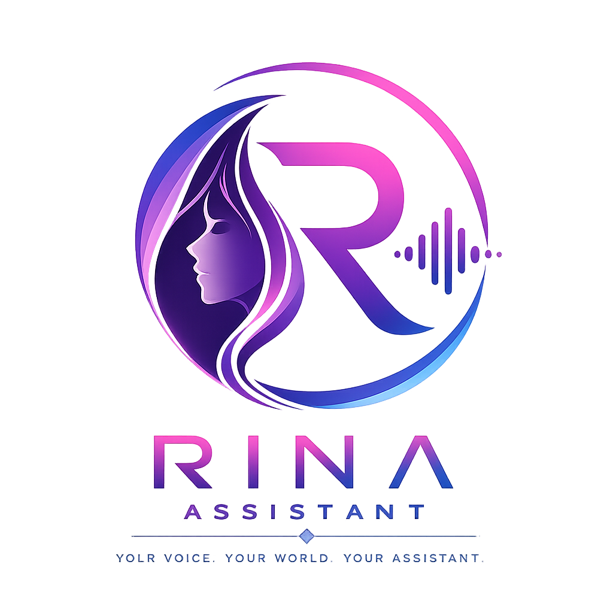
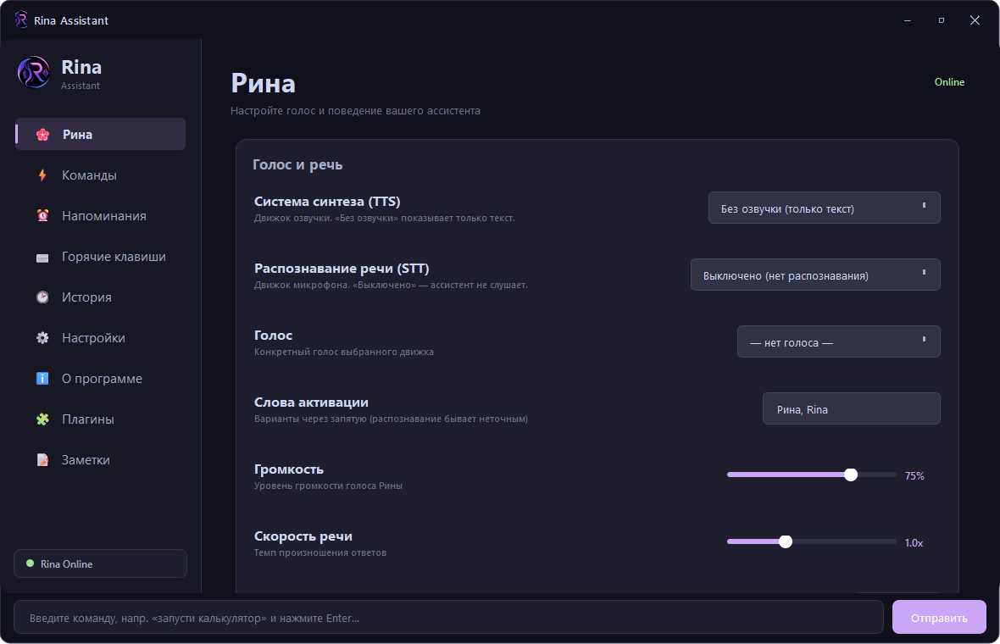
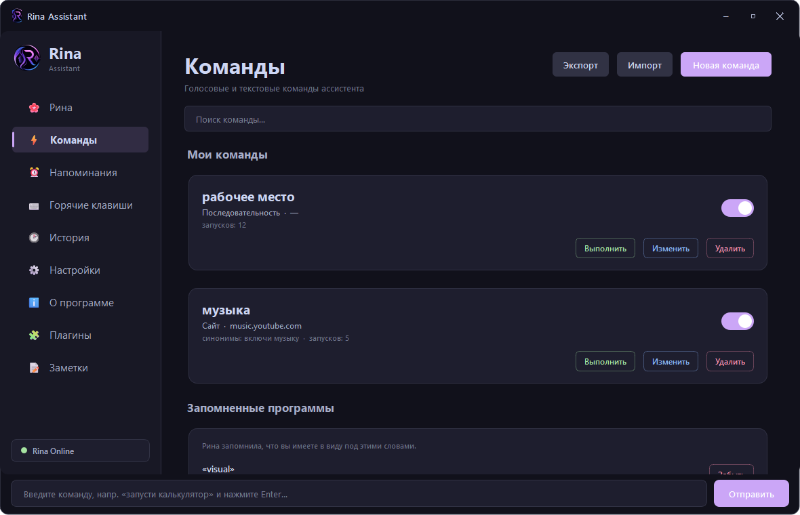
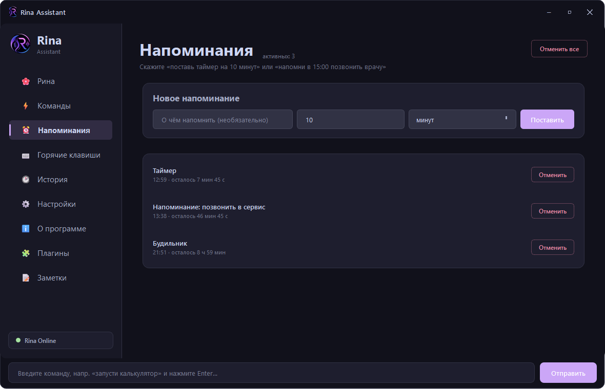
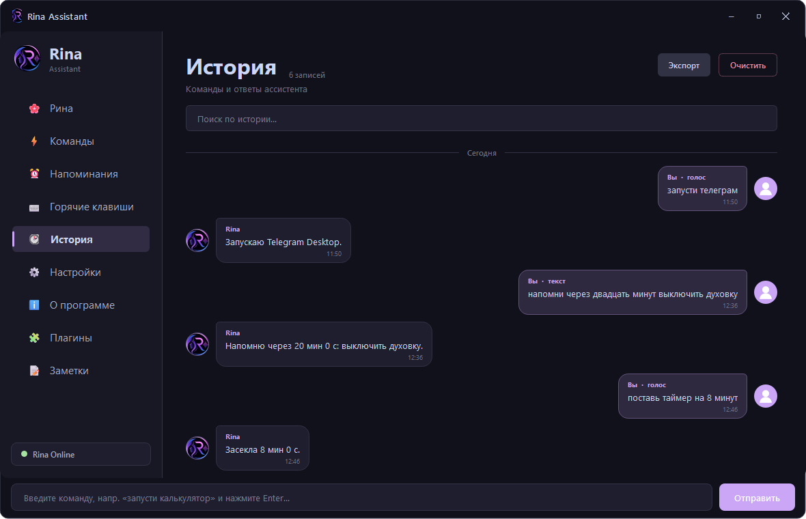
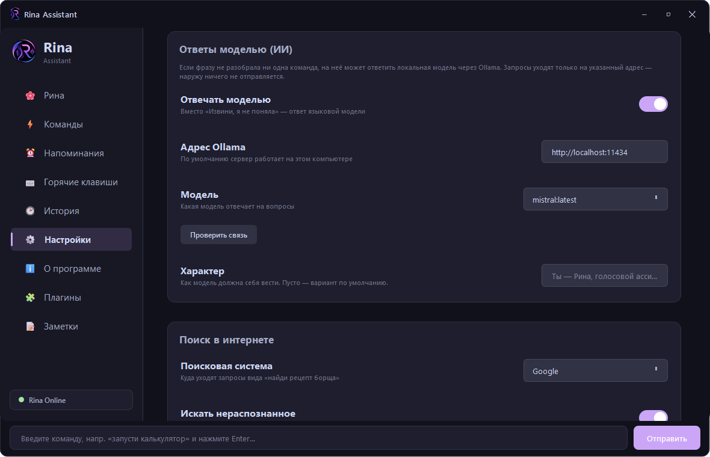
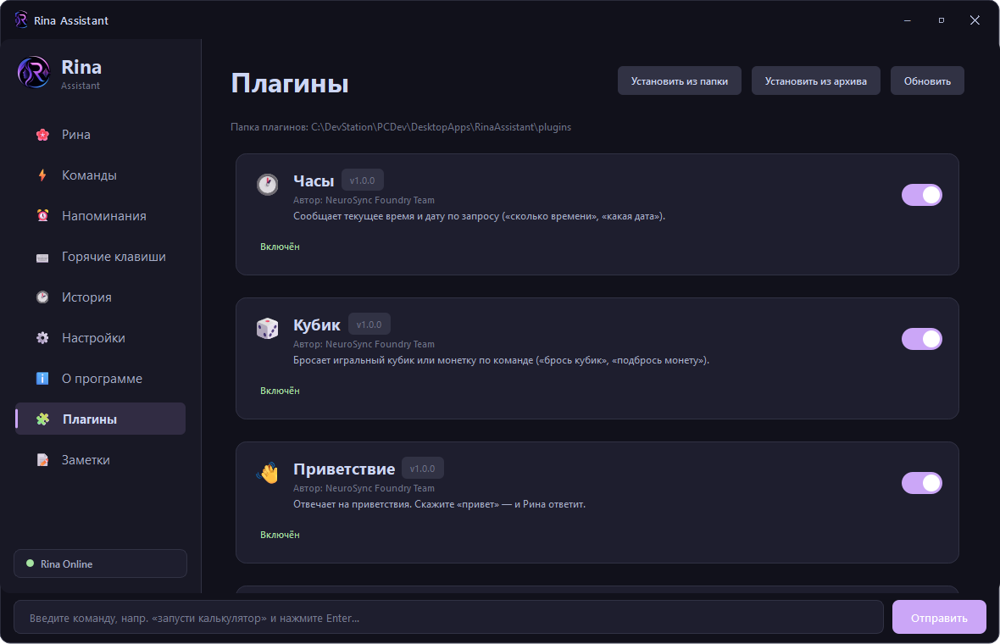

# Rina Assistant

<p align="center">
  
</p>

<h3 align="center">
A desktop voice assistant for Windows — launches your apps, keeps your timers, and answers when asked.
</h3>

<p align="center">
  <b>Version 3.1.0</b> · Windows · Python 3.10+ · Apache-2.0
</p>

---

## About

**Rina Assistant** listens, understands what you asked for, and does it: opens the program you named even if you named it in the wrong alphabet, sets a timer, changes the volume, does the arithmetic, searches the web, or — if you enable it — answers the question with a language model running on your own machine.

Everything runs locally by default. No account, no cloud service, no telemetry.

Rina Assistant is developed as part of the **NeuroSync Foundry** ecosystem.

---

## Screenshots

| | |
|---|---|
|  |  |
| **Main** — dialogue, microphone, quick actions | **Commands** — your own phrases and sequences |
|  |  |
| **Reminders** — timers, alarms, reminders | **History** — everything said, grouped by day |
|  |  |
| **Settings** — voice, recognition, local model | **Plugins** — install, enable, configure |

---

## What it does

### Launching applications

Rina indexes what is actually installed on the machine — Start Menu shortcuts, the registry, Store (UWP) apps, and any portable folders you point her at. You do not register programs by hand.

- **Type it however you speak it.** "Открой телеграм" finds *Telegram*; Cyrillic input is transliterated and matched fuzzily, so near-misses and mishearings still land.
- **Ambiguity is asked about, not guessed.** Several matches produce a question, and your answer is remembered as an alias for next time.
- **Portable programs** without an installer can be added by path.

### Voice

Speech synthesis and recognition are pluggable — pick what suits the machine.

**Text to speech:** silent (text only), `pyttsx3` (offline, system voices), Edge Neural TTS (online, best quality), gTTS (online), Piper (offline neural, needs an `.onnx` model).

**Speech to text:** disabled, Google, Vosk (offline), Whisper (offline), PocketSphinx.

Wake-word activation tolerates imperfect recognition, and always-listen mode is available.

### Commands and sequences

Six kinds of user commands — launch an app, open a folder, open a website, say something, run a system action, or run a **sequence** that chains several steps with pauses. Commands can be exported and imported between machines; anything imported arrives **disabled**, so nothing runs before you have looked at it.

### Reminders

Timers, alarms and reminders in plain language — "поставь таймер на 10 минут", "напомни через полчаса позвонить маме", "разбуди в 7:30". They survive restarts and fire from a background scheduler.

### System control

Eleven actions: volume up/down/mute, media next/previous/play-pause, lock, screenshot, sleep, restart, shutdown. Destructive ones always ask first — a single misheard phrase can never power off the machine.

### Answers

- **Arithmetic** is evaluated from a parsed expression tree, never with `eval`.
- **Unrecognised phrases** fall back to a web search.
- **Optional local model.** With Ollama installed, anything unparsed can be answered by a model on your own computer. Off by default; when on, requests go only to the address in settings, and the settings page tells you plainly if that address is not local.

### Plugins

Plugins add commands, settings and their own page. Pages are **declarative** — a plugin describes its interface as data (`title`, `text`, `note`, `items`, `button`, `input`, `table`, `progress`, `badge`, `divider`) and never touches the UI toolkit. Install from a folder or a `.zip`; four plugins ship with the app (clock, dice, greeter, notes).

See [`plugins/README.md`](plugins/README.md) for the plugin API.

### Interface

Five themes (Catppuccin Mocha, Catppuccin Macchiato, Tokyo Night, Nord, Dracula), five interface languages (Русский, English, Українська, Español, Deutsch), a floating command bar, tray integration, autostart, a global hotkey, a first-run wizard, and a full history with export to JSON or plain text.

---

## Architecture

Version 3.0.0 separated the thinking from the window.

```
core/engine.py      the whole pipeline — no Qt imports at all
core/events.py      event bus: the core announces, it never touches a widget
core/protocol.py    every event and payload declared in one place, versioned
voice/service.py    a thin Qt adapter that turns core events into signals
```

The command pipeline runs in order: pending question → plugins → user commands → reminders → system control → application launcher → built-ins → language model → web search.

Because the core imports no Qt, it can be driven and tested headless, and a background thread can no longer call into the interface by accident. This is deliberate groundwork: version 4.0.0 moves the shell to C# and the core becomes a separate process speaking a protocol.

---

## Project structure

```
RinaAssistant/
│
├── animations/   UI animations and effects
├── app/          application shell and main window
├── assets/       icons, logo, emblem
├── components/   reusable UI components
├── core/         headless core: engine, events, protocol, settings, i18n, theme, LLM
├── dialogs/      dialogs (first run, update, plugin install)
├── docs/         screenshots
├── pages/        application pages
├── plugins/      plugin system and bundled plugins
├── voice/        speech, recognition, app index, reminders, system control
│
└── main.py       entry point
```

---

## Installation

Requires **Windows** and **Python 3.10+**.

```bash
git clone https://github.com/Luna-coreX/RinaAssistant.git
cd RinaAssistant
pip install -r requirements.txt
python main.py
```

Only `PySide6` is strictly required. Voice engines are optional and listed in `requirements.txt` — install the ones you intend to use. Some (Vosk, Piper) need a model file downloaded separately.

### Optional: local AI answers

Install [Ollama](https://ollama.com), pull a model, then enable it in **Settings → AI**:

```bash
ollama pull llama3.1:8b
```

Rina talks to `http://localhost:11434` by default and checks the connection from the settings page.

---

## Roadmap

**4.0.0 — Separation and redesign.** The core becomes a standalone Python service; the shell and system layer are rewritten in C# (WPF) with a protocol between them. Because the shell is new code regardless, the interface is redesigned rather than ported. No new user-facing capabilities.

**5.0.0 — Platform.** End-to-end streaming (speech starts while the answer is still being generated, and can be interrupted), persistent memory, mature tool registry with granular permissions.

---

## Contributing

Issues and pull requests are welcome — see [`CONTRIBUTING.md`](CONTRIBUTING.md). When reporting a bug, include the version, what you said or typed, and what happened instead.

---

## Changelog

See [`CHANGELOG.md`](CHANGELOG.md). Security policy and trust boundaries: [`SECURITY.md`](SECURITY.md).

---

## License

Apache License 2.0 — see [`LICENSE`](LICENSE) and [`NOTICE`](NOTICE).

Releases up to and including 3.1.0 were published under the MIT licence; copies obtained under those terms keep them. Contributions are accepted under Apache-2.0 with no separate agreement — see [`CONTRIBUTING.md`](CONTRIBUTING.md) and [ADR 0001](docs/adr/0001-license-and-contributions.md).

---

## Links

- **NeuroSync Foundry** — https://neurosync-foundry-portal.pages.dev/
- **Repository** — https://github.com/Luna-coreX/RinaAssistant
- **Issues** — https://github.com/Luna-coreX/RinaAssistant/issues

<p align="center">
  Made with Python
</p>
