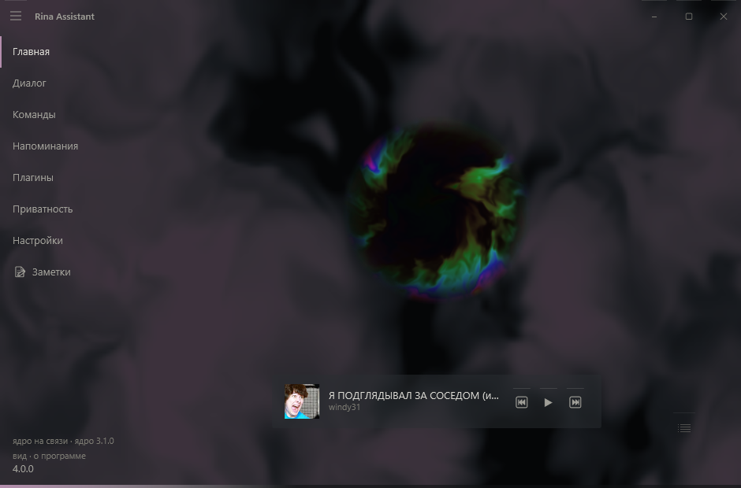
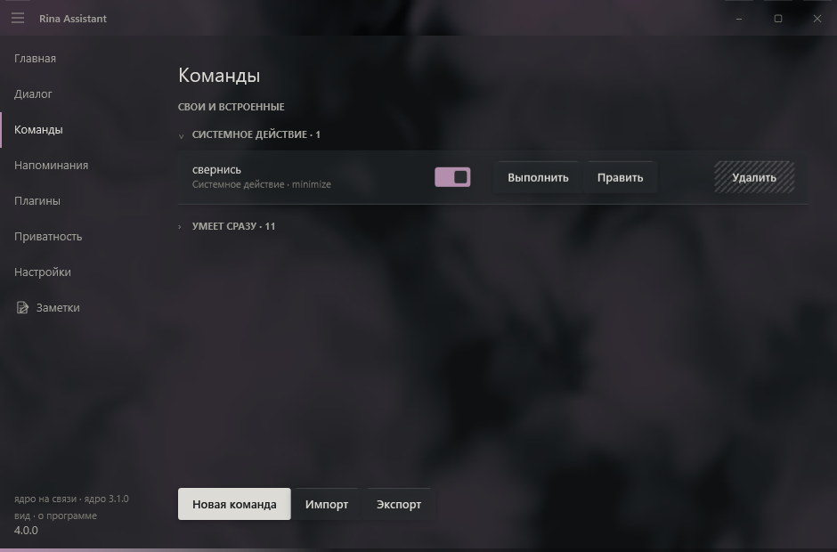
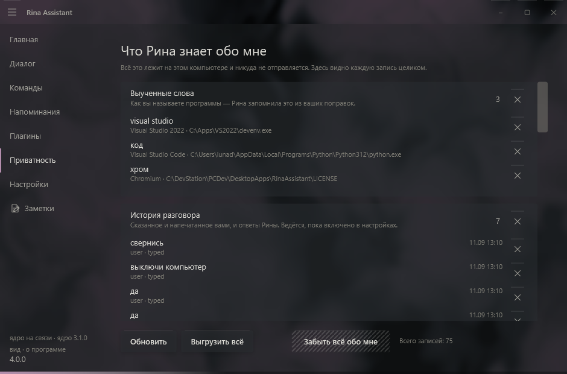
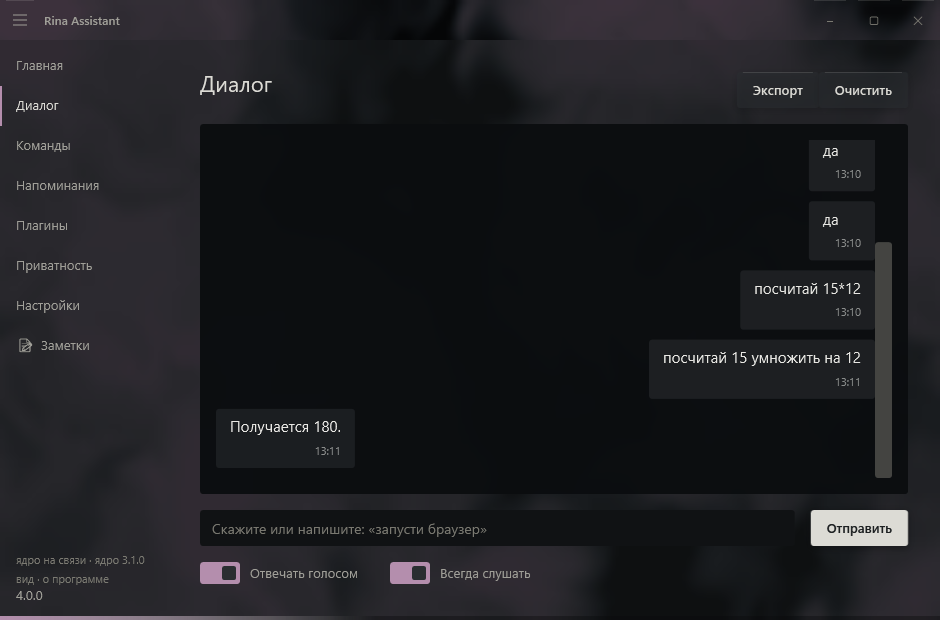
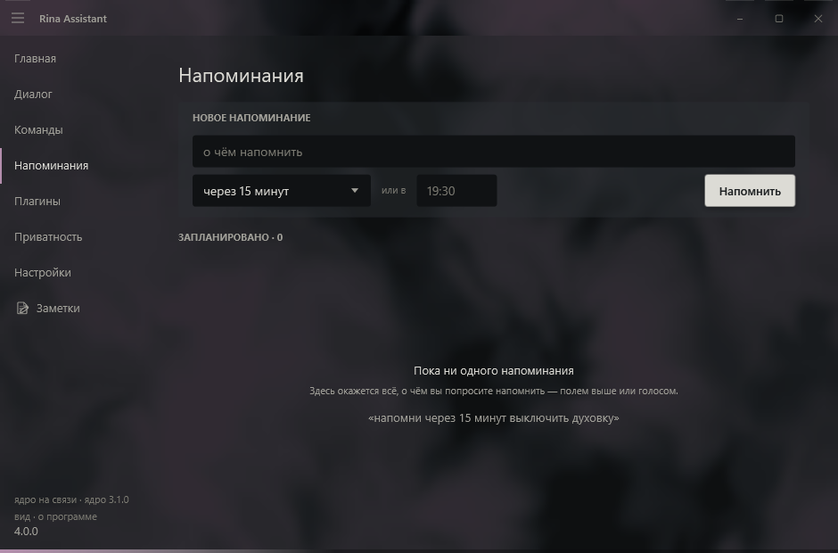
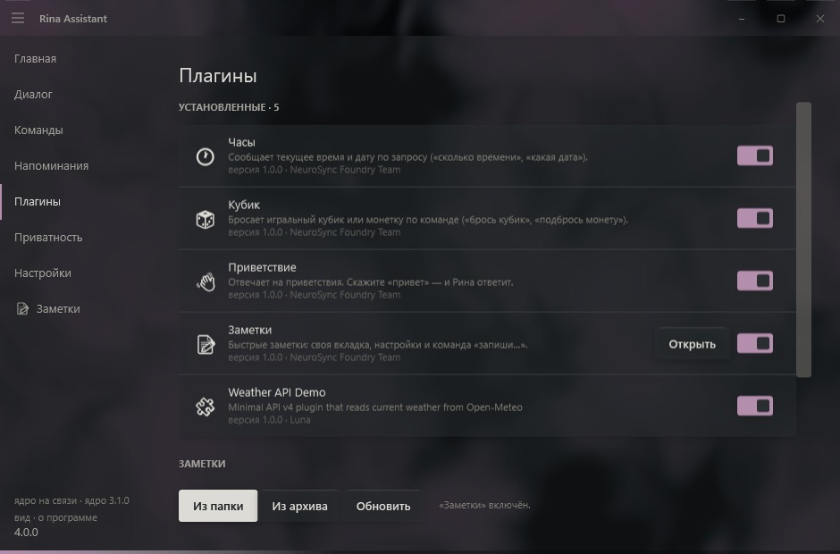
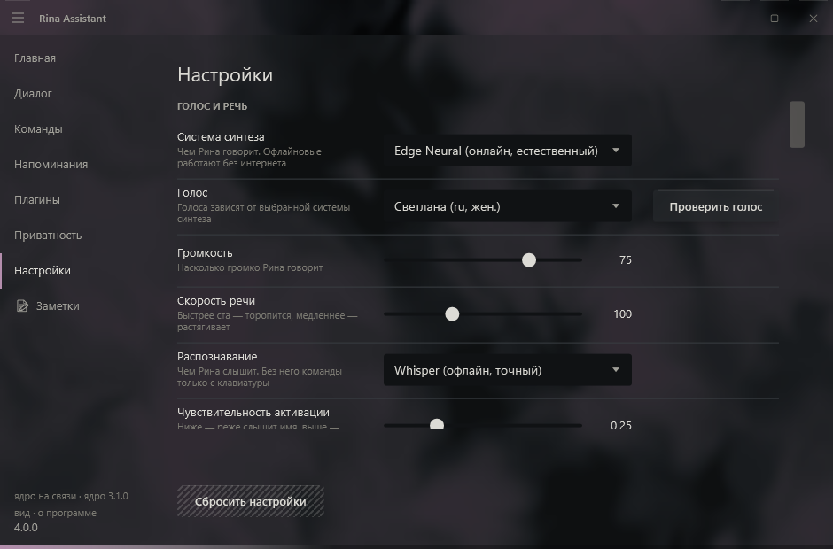

# Rina Assistant

<p align="center">
  
</p>

<h3 align="center">
A desktop voice assistant for Windows — launches your apps, keeps your timers, and answers when asked.
</h3>

<p align="center">
  <b>Version 4.0.0-port</b> · Windows · Python 3.10+ · .NET 9 · Apache-2.0
</p>

---

## Say it, and it happens

**Rina Assistant** listens, works out what you asked for, and does it: opens the
program you named even if you named it in the wrong alphabet, sets a timer,
changes the volume, does the arithmetic, searches the web, or — if you switch it
on — answers with a language model running on your own machine.

**Everything runs on your computer.** No account, no cloud service, no
telemetry. There is a page inside the program that lists every single thing it
has remembered about you, and a button to make it forget any of it.

<p align="center">
  <br>
  <sub>She is one shape when waiting, another when listening, another when
  answering — the window says what is happening without a word for it.</sub>
</p>

---

## Try it in five minutes

Requires **Windows**, **Python 3.10+** and **.NET 9**.

```bash
git clone https://github.com/Luna-coreX/RinaAssistant.git
cd RinaAssistant
pip install -r requirements.txt
dotnet run --project shell/Rina.Shell
```

The shell starts the core itself — you never run it separately. On the first
launch a short wizard asks which voice and which recognition you want and
downloads only those.

Then say — or type — **«открой блокнот»**, **«поставь таймер на 5 минут»**,
**«сколько будет 17 на 23»**.

---

## What it looks like

| | |
|---|---|
|  |  |
| **Commands** — your own, grouped by kind; the built-in ones folded away | **What Rina knows about me** — every stored thing, and a way to forget it |
|  |  |
| **Dialogue** — the conversation, with who said what and when | **Reminders** — timers, alarms, and reminders tied to a program |
|  |  |
| **Plugins** — install, switch on, each with a page of its own | **Settings** — the core sends the meaning, the shell decides the look |

---

## What is new in 4.0

**Rina became two programs.** The core on Python thinks; the shell on C# (WPF) shows and touches the machine. Between them — a protocol with two channels.

This is not a rearrangement of folders. It is what makes the rest possible:

- the core runs **headless** — no window, no Qt, no interface library at all;
- a plugin that hangs no longer takes Rina with it: each lives in its own process;
- the interface was **designed anew** rather than ported, because the shell is new code regardless.

No new user-facing capabilities: the 4.0-port boundary forbids losing behaviour and does not ask for more. What behaviour existed is pinned by 112 recorded utterances and seven recorded sessions.

See [`docs/ARCHITECTURE.md`](docs/ARCHITECTURE.md).

---

## What it does

### Launching applications

Rina indexes what is actually installed on the machine — Start Menu shortcuts, the registry, Store (UWP) apps, and any portable folders you point her at. You do not register programs by hand.

- **Type it however you speak it.** "Открой телеграм" finds *Telegram*; Cyrillic input is transliterated and matched fuzzily, so near-misses and mishearings still land.
- **Ambiguity is asked about, not guessed.** Several matches produce a question, and your answer is remembered as an alias for next time.
- **Unsigned programs are asked about once.** The question shows everything you could decide by: the name, the full path, where the index found it.

### Voice

Speech synthesis and recognition are pluggable — pick what suits the machine.

**Text to speech:** silent (text only), `pyttsx3` (offline, system voices), Edge Neural TTS (online, best quality), gTTS (online), Piper (offline neural, needs an `.onnx` model).

**Speech to text:** disabled, Google, Vosk (offline), Whisper (offline), PocketSphinx.

The models live in the core, the microphone and the speaker in the shell — the sound travels between them over a channel of its own, so a second of speech never queues behind a button press.

### Commands, assembled as a graph

A command is a **graph**: steps stand as nodes with wires between them, and a
simple command is a graph of one node. Six kinds of thing can happen — launch an
app, open a folder, open a website, say something, run a system action, run a
sequence — and seven more exist only as steps inside one: wait, repeat N times,
repeat while, if/else, stop the scenario, call another command, remember a
value.

Conditions can ask about the world as well as the clock: which program is in
front, whether one is running, whether a file exists, whether Ollama answers,
the time, the day, a value you set earlier in the same run.

Nodes are dragged onto the ports between other nodes, and «Проверить» runs the
graph without saving it — lighting each step green as it goes and red where it
stops.

Commands can be exported and imported between machines; anything imported
arrives **disabled**, so nothing runs before you have looked at it.

### Reminders

Timers, alarms and reminders in plain language — "поставь таймер на 10 минут", "напомни через полчаса позвонить маме", "разбуди в 7:30". They survive restarts and fire from a background scheduler, with the window closed and from the tray.

### System control

Sixteen actions: volume up/down/mute, media next/previous/play-pause, lock,
screenshot, sleep, restart, shutdown, and the ones that move Rina's own window. Destructive ones always ask first, and the question shows **what will happen** rather than the action's name — a single misheard phrase can never power off the machine.

### Answers

- **Arithmetic** is evaluated from a parsed expression tree, never with `eval`.
- **Unrecognised phrases** fall back to a web search.
- **Optional local model.** With Ollama installed, anything unparsed can be answered by a model on your own computer. Off by default; when on, requests go only to the address in settings, and the settings page tells you plainly if that address is not local.

### Plugins

Plugins add commands, settings and their own section in the column. A plugin **declares** rather than does: its tools go into the core's registry and get the same gates as the built-in ones — permissions, confirmation of the irreversible, an entry in the journal.

Pages are **declarative**: a plugin describes its interface as data and never touches the UI toolkit. That is why not one bundled plugin had to be rewritten when the entire shell changed language.

See [`docs/plugins/WRITING-PLUGINS.md`](docs/plugins/WRITING-PLUGINS.md).

### Interface

Three finishes (silver, black and graphite) with a choice of accent, five interface languages (Русский, English, Українська, Español, Deutsch), a floating command bar, tray integration, autostart, global hotkeys, and a full history with export.

The design is a document, not a mood: [`docs/design/SYSTEM.md`](docs/design/SYSTEM.md). Every colour pair is checked for contrast, and the drawn window is compared with the tokens pixel by pixel.

---

## Architecture

```
     shell/Rina.Shell (C#, WPF)      windows, microphone, speaker,
              │                      app index, process launching,
              │                      signatures, tray, hotkeys
     ┌────────┴────────┐
     │  control (JSON) │             commands, settings, events,
     │  data (bytes)   │             permissions, audio both ways
     └────────┬────────┘
              │
     core/ + voice/ (Python)         parsing, tool registry, permissions,
                                     confirmations, recognition, synthesis,
                                     reminders, storage, Rina's own words
              │
     plugins/ (Python)               one process per plugin
```

Three boundaries explain nearly everything else:

- **the core decides, the shell shows** ([ADR 0006](docs/adr/0006-settings-ownership.md));
- **the machine is touched by the shell** ([ADR 0009](docs/adr/0009-system-layer.md)) — the core cannot launch a program, it can ask;
- **interface words belong to the shell, Rina's lines to the core** ([ADR 0007](docs/adr/0007-localisation.md)).

Everything that changes the world goes through one registry (`core/toolrunner.py`), and that is an invariant checked across every file of the core, not a convention.

---

## Project structure

```
RinaAssistant/
│
├── core/         headless core: engine, router, registry, protocol, storage
│   └── wire/     the protocol: envelope, handshake, events, channels, errors
├── voice/        speech, recognition, reminders, user commands, app index
├── plugins/      plugin API, manager, plugin process, three bundled plugins
├── shell/
│   ├── Rina.Shell/     window, pages, styles, system layer (C#, WPF)
│   └── Rina.Protocol/  the client half of the protocol (C#)
├── tools/        checks, runners, generators
├── docs/         plan, specification, decisions, design system, guides
├── archive/      the 3.1.0 single-process application, kept for reference
│
└── rina_core.py  the core's entry point
```

The 3.1.0 application is in [`archive/`](archive/README.md) and no longer
runs from the tree: it was one process with the interface and the core in
shared memory, and 4.0 replaced it with two programs. It is kept because
the port promised not to lose behaviour, and reading how something worked
is cheaper than reconstructing it from the log.

---

## Installation, in more detail

The short version is at the top. What is worth knowing beyond it:

The shell takes the Python from the project's environment if there is one, and
only then whatever is in `PATH`. The voices and the recognition models are
installed **in the environment**, so a core started with "just python" comes up
and honestly reports that it has no engines.

Voice engines are optional and listed in `requirements.txt`. The first-run
wizard installs the ones you pick; you can also install them by hand. Some
(Vosk, Piper) need a model file, which the wizard downloads.

### Optional: local AI answers

Install [Ollama](https://ollama.com), pull a model, then enable it in **Settings**:

```bash
ollama pull llama3.1:8b
```

Rina talks to `http://localhost:11434` by default and warns you plainly if you point her anywhere that is not local.

---

## Development

```bash
python tools/regress.py          # 65 checks, about four minutes
python tools/regress.py --list   # what they are
```

Behaviour is pinned by a golden set of 112 utterances and seven recorded sessions; the protocol by a conformance suite that lets both sides see only bytes; the design by comparing the drawn window with the tokens.

How to debug two processes at once — [`docs/DEBUGGING.md`](docs/DEBUGGING.md).

---

## What this costs

**Nothing, and the part you are using now will go on costing nothing.**

Said once, plainly, because the alternative is saying it later and having it
read as a change of mind:

- **The beta is free.** All of it. Nothing is held back behind a plan, and
  there is no payment code in the program to hold anything back with.
- **The local base stays free.** Everything that runs on your machine —
  voice in and out, launching programs, commands, reminders, plugins, the
  local model, the privacy page — is the product, not a trial of it. It is
  Apache-2.0, and a licence cannot be taken back from a copy you already
  have.
- **Some advanced capabilities may be paid later.** Most likely candidates
  are things that cost money to run — a service on somebody's server, a
  connector to a paid third party. If that happens it will be *additional*,
  and this list is the promise it will be measured against.

**What is open stays open**, and that is decided rather than hoped: the code
that handles audio and your data, the safe launching of programs, the
confirmation of dangerous actions, the security journal, the protocol, and
the base functionality. What could reasonably close later is a licence
server, billing, and paid connectors — none of which is on your computer.

There is no telemetry, no account, and nothing to opt out of.

---

## Roadmap

**4.0.0-port — separation and redesign.** Nearly complete: the core is a standalone service, the shell and system layer are C#, the protocol is between them, the interface is redesigned. What remains is the installer.

**4.0-beta — public free beta.** Whether the product is useful, and real scenarios.

**5.0.0 — platform.** End-to-end streaming (speech starts while the answer is still being generated, and can be interrupted), persistent memory, controlling the computer under granular permissions.

Full plan: [`docs/ROADMAP.md`](docs/ROADMAP.md).

---

## Security

What we defend against, from whom, and with what — [`docs/security/THREAT-MODEL.md`](docs/security/THREAT-MODEL.md). Six surfaces, twenty-two threats, and for each of them the **residual risk**
written down, because a defence without one has stopped being thought about.
The sweep that walks that document rather than a list somebody maintains is
`tools/test_security.py`.

Reporting a vulnerability: [`SECURITY.md`](SECURITY.md).

---

## Contributing and feedback

Issues and pull requests are welcome — see [`CONTRIBUTING.md`](CONTRIBUTING.md).

- **Something broke** or **something is missing** — [Issues](https://github.com/Luna-coreX/RinaAssistant/issues); the forms ask for what is actually needed to look into it.
- **A question, or "does it work with…"** — [Discussions](https://github.com/Luna-coreX/RinaAssistant/discussions).
- **A vulnerability** — not in public: [`SECURITY.md`](SECURITY.md).

What happens to something once it arrives — who reads it, in what time, and
what the four possible outcomes are — is written down in
[`docs/TRIAGE.md`](docs/TRIAGE.md), so that "no answer yet" can be told from
"nobody is reading". When reporting a bug, attach a diagnostic package: **About → Diagnostics → Collect**. It gathers the logs of both layers, the versions and the state of the link, and says inside exactly what it left out.

---

## Changelog

See [`CHANGELOG.md`](CHANGELOG.md).

---

## License

Apache License 2.0 — see [`LICENSE`](LICENSE) and [`NOTICE`](NOTICE).

Releases up to and including 3.1.0 were published under the MIT licence; copies obtained under those terms keep them. Contributions are accepted under Apache-2.0 with no separate agreement — see [`CONTRIBUTING.md`](CONTRIBUTING.md) and [ADR 0001](docs/adr/0001-license-and-contributions.md).

---

## Links

- **NeuroSync Foundry** — https://neurosync-foundry-portal.pages.dev/
- **Repository** — https://github.com/Luna-coreX/RinaAssistant
- **Issues** — https://github.com/Luna-coreX/RinaAssistant/issues

<p align="center">
  Made with Python and C#
</p>
